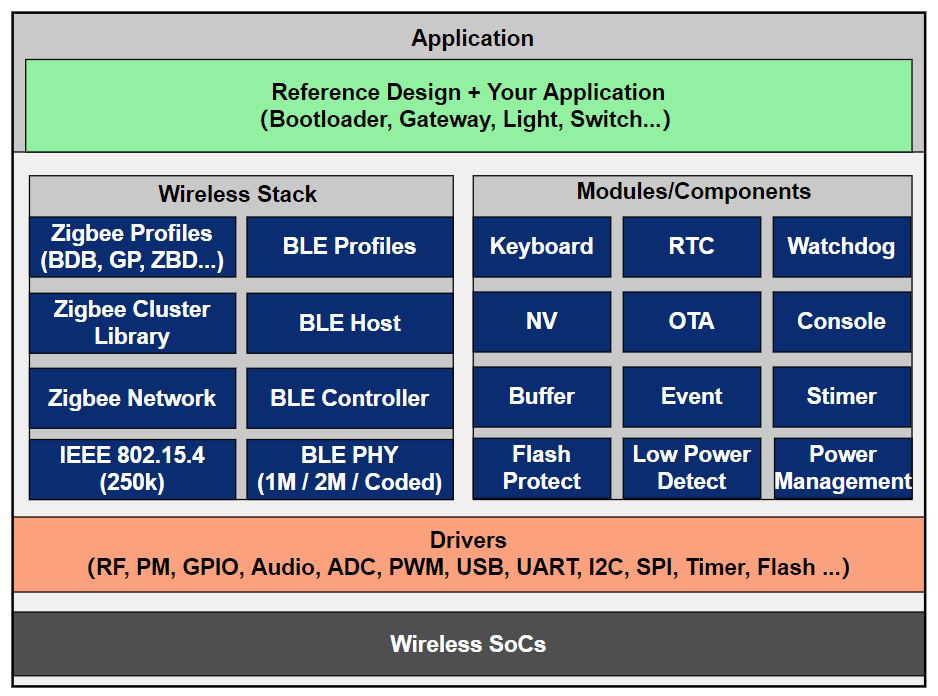

# telink\_zigbee\_sdk README

* [中文版](./README_CN.md)

# SDK Introduction

telink_zigbee_sdk is a Zigbee 4.0 software development platform for Telink's SoCs, including TL321x, TL323x, TLSR921x, and other series, specifically designed for low-power, long-range, self-organizing, and self-healing network application scenarios, enabling efficient development of Zigbee products for smart homes, industrial control, and other applications.

The SDK provides a complete software system, including low-level chip drivers, adaptation-layer drivers, a Zigbee/BLE dual-mode protocol stack, rich engineering examples, ZGC (Zigbee Gateway Controller) function demonstration tools, and OTA (Over-The-Air) upgrade tools, fully supporting the entire R&D cycle from product prototyping to mass production.

**Core Competencies**

| Category | Ability |
| --- | --- |
| Wireless connectivity | Supports the Zigbee 4.0 protocol stack, compatible with dual-protocol Zigbee and BLE concurrent operation |
| Software frameworks | Provides standardized peripheral drivers and security components (including AES, Hash, SHA-256, C25519, and other algorithms), adopts modular layered design for easy function expansion and maintenance |
| System services | Integrates clock management, event scheduling, power management, non-volatile (NV)  storage management, and OTA firmware upgrade management to ensure efficient and stable system operation |

You can quickly develop a range of terminal products, such as Zigbee smart gateways, lighting fixtures, and sensors, using this SDK.

**Typical Applications**

| Wireless technology | Application areas | Typical products |
| --- | --- | --- |
| Zigbee 4.0 | Smart homes | Smart lighting (fixtures, switches), smart home appliances, temperature and humidity sensors, door and window sensors, smart door locks, etc. |
|  | Industrial controllers | Equipment status monitoring, environmental data collection, wireless instruments, etc |
|  | Gateway and bridge | Zigbee smart gateway, multi-protocol edge gateway, etc |

**Support Information**

For a complete and accurate list of supported chip series, corresponding development boards and platforms, toolchains, and detailed SDK versions, please refer to the [Release Notes](./doc/telink_zigbee_sdk_Release_Note.md).

# Documentation and Resources

**Document Navigation**

| **Documentation** | **Description** |
| --- | --- |
| [Get Started](https://doc.telink-semi.cn/doc/zh/software/res/sdk/zigbee/get_started/telink_zigbee_sdk_get_started_cn/) | Configuring the development environment, obtaining the SDK, and getting started |
| [Developer Handbook](https://doc.telink-semi.cn/doc/zh/software/res/sdk/zigbee/zigbee_sdk_developer_manual_cn/) | Detailed description of software architecture, warehouse structure, and functional modules |
| [Engineering Examples](./tl_zigbee_sdk/apps/) | Engineering examples and usage instructions |
| [Release Notes](./doc/telink_zigbee_sdk_Release_Note.md) | Supported platforms, version notes, and detailed changes |

**Community and Resources**

| **Resources** | **Description** |
| --- | --- |
| [Telink Official Forum](https://forum.telink-semi.cn/) | Technical support and discussion |
| [Telink Official Website](https://www.telink-semi.com/) | Product and Documentation Center |
| [GitHub](https://github.com/telink-semi/telink_zigbee_sdk) / [Gitee](https://gitee.com/telink-semi/telink_zigbee_sdk) | SDK source code repository |

# Licenses

This project adopts the following permits:

**Apache License, Version 2.0**

Licensed under the Apache License, Version 2.0 (the "License");

You may not use this file except in compliance with the License.

You may obtain a copy of the License at:

[http://www.apache.org/licenses/LICENSE-2.0](http://www.apache.org/licenses/LICENSE-2.0)

Unless required by applicable law or agreed to in writing, software distributed under the License is distributed on an "AS IS" BASIS, WITHOUT WARRANTIES OR CONDITIONS OF ANY KIND, either express or implied.

See the License for the specific language governing permissions and limitations under the License.
